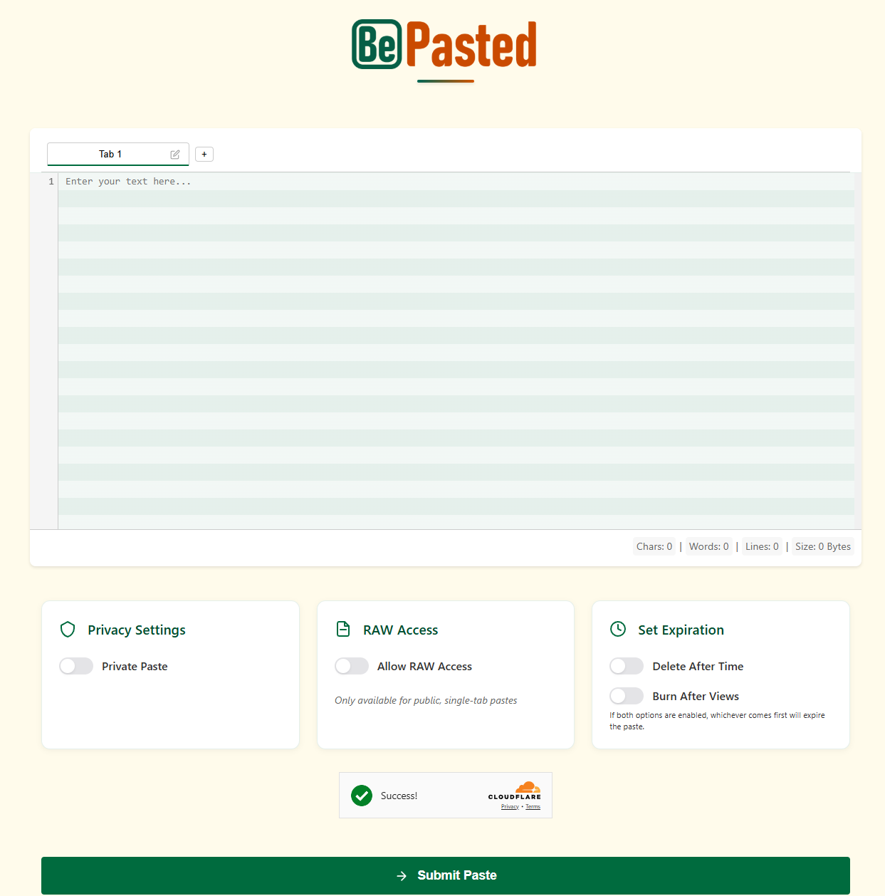
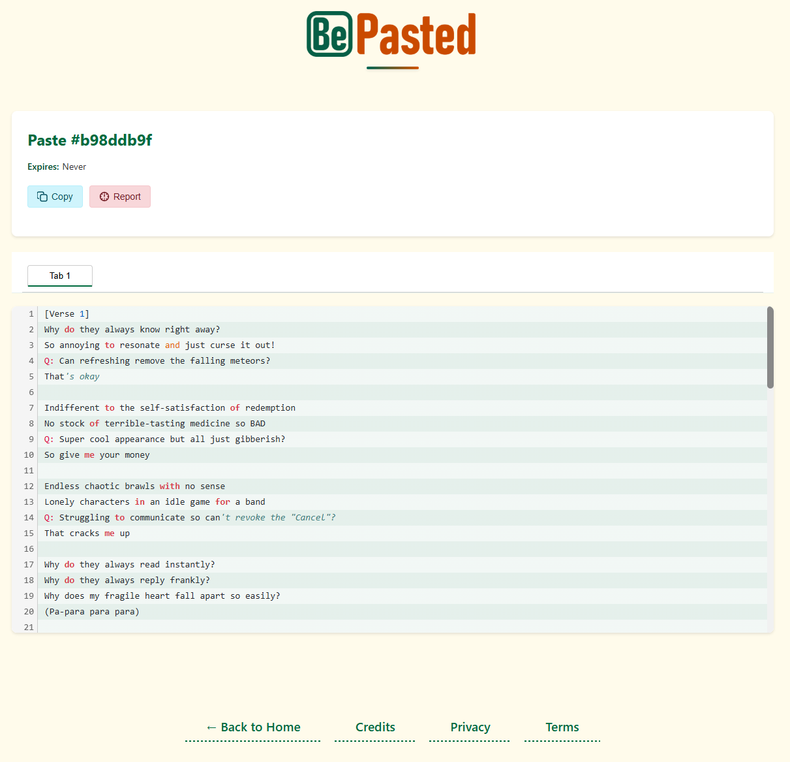
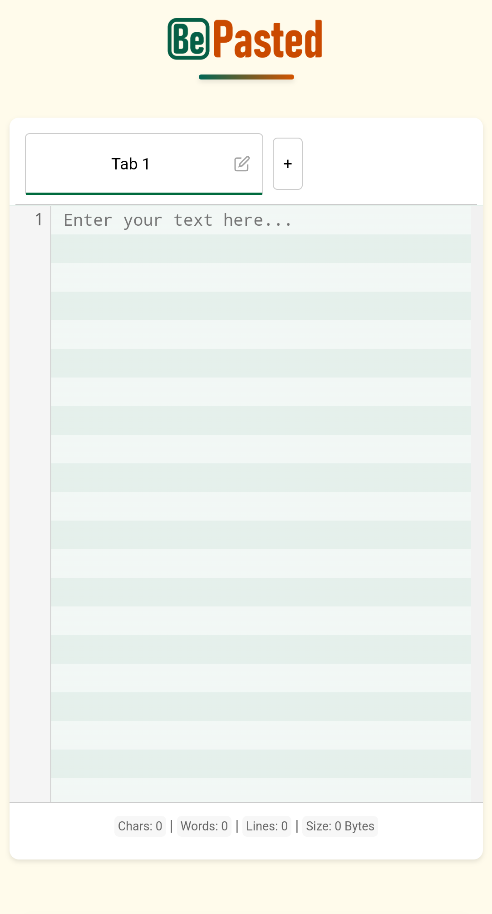

<div align="center">
  
  <h1>BePasted</h1>
  <p><strong>A free, no-login paste service prioritizing privacy, simplicity, and security</strong></p>

  [](https://opensource.org/licenses/ISC)
  [](https://nodejs.org/)
  [](https://www.mongodb.com/)
  [](https://hono.dev/)
  [](https://github.com/rimunace/bepasted/pulls)

</div>

## 📋 Table of Contents

- [Overview](#-overview)
- [Key Features](#-key-features)
- [Screenshots](#-screenshots)
- [Technical Stack](#-technical-stack)
- [Security & Privacy](#-security--privacy)
- [Getting Started](#-getting-started)
- [Development](#-development)
- [API Documentation](#-api-documentation)
- [Rate Limiting](#-rate-limiting)
- [Contributing](#-contributing)
- [License](#-license)

## 🌟 Overview

BePasted is a modern, privacy-focused text and code sharing service built with a "less is more" philosophy. Unlike many alternatives, BePasted requires no account creation while still providing powerful features. We prioritize user privacy and content security without compromising on functionality.

## ✨ Key Features

- **Multi-tab Support** - Create up to 10 tabs per paste for organizing related content
- **Code Highlighting** - Automatic syntax detection with theme support
- **Line Numbers & Word Counter** - For better readability and reference
- **Privacy Options**:
  - Password-protected pastes with bcrypt encryption
  - Customizable expiration (time-based or view-based)
  - Burn-after-reading functionality
- **Raw Text Access** - Direct access to paste content for public, single-tab pastes
- **Responsive Design** - Works seamlessly on desktop and mobile devices
- **No Registration Required** - Create and share pastes instantly

## 📸 Screenshots

<div align="center">
  
  
  <p><em>Home Screen and Paste View</em></p>
</div>

<div align="center">
  
  <p><em>Responsive Mobile Experience</em></p>
</div>

## 🔧 Technical Stack

<table>
  <tr>
    <th>Backend</th>
    <th>Frontend</th>
    <th>Security</th>
  </tr>
  <tr>
    <td>
      <ul>
        <li><a href="https://nodejs.org/">Node.js</a></li>
        <li><a href="https://hono.dev/">Hono</a> framework</li>
        <li><a href="https://www.mongodb.com/">MongoDB</a></li>
        <li><a href="https://github.com/kelektiv/node.bcrypt.js">bcrypt</a></li>
        <li>Centralized config management</li>
      </ul>
    </td>
    <td>
      <ul>
        <li>Vanilla JavaScript</li>
        <li>Modern CSS with variables</li>
        <li>Responsive design</li>
      </ul>
    </td>
    <td>
      <ul>
        <li><a href="https://www.cloudflare.com/products/turnstile/">Cloudflare Turnstile</a></li>
        <li><a href="https://arcjet.com/">Arcjet</a> for DDoS protection</li>
        <li><a href="https://betterstack.com/">BetterStack</a> for monitoring</li>
      </ul>
    </td>
  </tr>
</table>

## 🔒 Security & Privacy

BePasted implements numerous security and privacy features:

### Privacy Protection
- ✅ IP anonymization with cryptographic hashing
- ✅ Strict data retention policies (configurable, defaults: 30 days for active pastes, 90 days for archived)
- ✅ No tracking cookies or user profiling
- ✅ Privacy-focused analytics with SimpleAnalytics

### Security Measures
- ✅ Content scanning for malicious code and sensitive data
- ✅ CSRF protection against cross-site request forgery
- ✅ Strict input validation and content sanitization
- ✅ Secure password handling with bcrypt
- ✅ Rate limiting to prevent abuse

### Infrastructure Security
- ✅ Database connection pooling with security timeouts
- ✅ Comprehensive error handling and secure logging
- ✅ Cross-Origin Resource Sharing (CORS) protection
- ✅ BetterStack for centralized, privacy-focused logging

## 💻 Getting Started

### Prerequisites
- Node.js 18 or higher
- MongoDB 4.4 or higher
- A Cloudflare account for Turnstile integration

### Installation

1. **Clone the repository**
   ```bash
   git clone https://github.com/rimunace/bepasted.git
   cd bepasted
   ```

2. **Install dependencies**
   ```bash
   npm install
   ```

3. **Configure environment**
   ```bash
   cp .env.example .env
   ```

4. **Generate security keys** 
   
   On Linux/macOS/WSL:
   ```bash
   # Generate random values for IP_HASH_SALT and CSRF_SECRET
   openssl rand -hex 32 # Use this for IP_HASH_SALT
   openssl rand -hex 32 # Use this for CSRF_SECRET
   ```
   
   On Windows:
   ```powershell
   # Run the included PowerShell script
   .\pwsh-scripts\generate-secrets.ps1
   ```

5. **Update the `.env` file** with:
   - Your MongoDB connection string
   - Cloudflare Turnstile credentials
   - Generated security keys
   - BetterStack token (if using)
   
   See the `.env.example` file for all available configuration options.
   BePasted uses a centralized configuration system that validates all settings,
   provides sensible defaults, and gives helpful error messages.

6. **Start the server**
   ```bash
   npm start
   ```

### Using Docker (Optional)

```bash
# Build the Docker image
docker build -t bepasted .

# Run the container
docker run -p 3000:3000 --env-file .env bepasted
```

## 🚀 Development

**Start the development server** with auto-reload:
```bash
npm run dev
```

**Run tests**:
```bash
npm test
```

**Build for production**:
```bash
npm run build
```

**Start the production server**:
```bash
npm start
```

### Configuration System

BePasted uses a centralized configuration system located in `src/utils/config/config.js` that provides:

- **Schema-based validation** with detailed error messages
- **Type conversion** (string to number, boolean, arrays)
- **Sensible defaults** for optional parameters
- **Environment-specific validation** (stricter in production)
- **Security awareness** by marking sensitive values

Benefits for developers:
- All configuration is accessed through a single `config` object
- Configuration errors are detected early at startup
- Types are automatically converted (no need for `parseInt` etc.)
- The schema serves as documentation for environment variables
- Strong security with validation of security-critical parameters

To add a new configuration parameter:
1. Add it to the `configSchema` object in `src/utils/config/config.js`
2. Define its type, validation rules, default value, etc.
3. Import and use from `config` in your modules: `import config from '../utils/config/config.js'`

### Data Retention Configuration

BePasted implements configurable data retention policies:

- `DATA_RETENTION_DAYS`: Controls how long active pastes are retained (default: 30 days)
- `ARCHIVE_RETENTION_DAYS`: Controls how long expired pastes are archived before deletion (default: 90 days)

These values can be adjusted in your `.env` file to meet your specific requirements or compliance needs.

### Utils Directory Structure

The `src/utils` directory is organized into categories for better code organization and maintainability:

- `config/` - Configuration-related utilities
- `http/` - HTTP request/response handling utilities
- `security/` - Security-related utilities (IP handling, rate limiting, etc.)
- `logging/` - Logging and error handling utilities
- `maintenance/` - System maintenance and cleanup utilities

For details on the directory structure and import guidelines, see [Utils Directory Structure](docs/utils-directory-structure.md).

## 📚 API Documentation (Advanced Users)

BePasted offers a simple API for programmatic access. This documentation is intended for advanced users who need to integrate with BePasted programmatically.

### API Endpoints

#### Create a Paste
```http
POST /paste
Content-Type: application/json
```

**Request Body:**
```json
{
  "tabs": [
    {
      "id": 0,
      "name": "main.js",
      "content": "console.log('Hello, world!');"
    }
  ],
  "isPrivate": false,
  "allowRaw": true,
  "expiry": {
    "value": 7,
    "unit": "days"
  },
  "token": "TURNSTILE_TOKEN"
}
```

**Required Fields:**
- `tabs`: Array of tab objects (max 10)
  - Each tab must have `id`, `name`, and `content`
  - Content size limit: 2MB per tab
- `token`: Cloudflare Turnstile token for bot protection

**Optional Fields:**
- `isPrivate`: Boolean (default: false)
- `password`: Required if isPrivate is true (1-32 characters)
- `allowRaw`: Boolean (default: false, only works for public, single-tab pastes)
- `expiry`: Object with `value` (minimum 5) and `unit` (seconds, minutes, hours, days)
- `burnCount`: Number of views after which paste expires (1-10000000000)

**Response:**
```json
{
  "id": "a1b2c3d4"
}
```

**Status Codes:**
- `200`: Success
- `400`: Invalid input
- `413`: Request entity too large
- `429`: Rate limit exceeded (10 pastes per minute per IP)

#### Get a Paste
```http
GET /api/paste/{id}
```

**Parameters:**
- `id`: Paste ID (path parameter)
- `password`: For private pastes (query parameter)

**Response:**
```json
{
  "tabs": [...],
  "isPrivate": false,
  "allowRaw": true,
  "expiry": {
    "value": 7,
    "unit": "days",
    "expiresAt": "2023-12-31T23:59:59Z"
  },
  "burnCount": 10,
  "currentViews": 3,
  "createdAt": "2023-12-24T12:00:00Z"
}
```

**Status Codes:**
- `200`: Success
- `401`: Password required or invalid
- `404`: Paste not found
- `410`: Paste has expired
- `429`: Too many password attempts

#### Get Raw Paste Content
```http
GET /api/paste/{id}/raw
```

**Parameters:**
- `id`: Paste ID (path parameter)

**Response:**
Raw text content with Content-Type: text/plain

**Status Codes:**
- `200`: Success
- `403`: Raw access not allowed
- `404`: Paste not found
- `410`: Paste has expired

#### Verify Password
```http
POST /paste/{id}/verify-password
Content-Type: application/json
```

**Request Body:**
```json
{
  "password": "your_password"
}
```

**Response:**
```json
{
  "success": true
}
```

**Status Codes:**
- `200`: Success
- `400`: Bad request
- `401`: Invalid password
- `404`: Paste not found
- `410`: Paste has expired
- `429`: Too many password attempts (6 attempts per minute per paste per IP)

#### Report a Paste
```http
POST /paste/{id}/report
Content-Type: application/json
```

**Request Body:**
```json
{
  "reason": "Contains malicious code"
}
```

**Response:**
```json
{
  "success": true,
  "message": "Paste reported successfully"
}
```

**Status Codes:**
- `200`: Success
- `400`: Invalid input
- `404`: Paste not found

**Rate Limiting:** 3 reports per minute per IP

### OpenAPI Specification

For a complete API reference, see the OpenAPI specification files in the repository:
- [openapi.json](openapi.json)
- [openapi.yaml](openapi.yaml)

## ⚠️ Rate Limiting

To prevent abuse while ensuring fair usage:

| Action | Limit |
|--------|-------|
| Paste Creation | 10 pastes per minute per IP |
| Private Paste Access | 6 password attempts per minute per IP |
| API Requests | 100 requests per minute per IP |

## 🤝 Contributing

Contributions are welcome! Here's how you can help:

1. **Fork the repository**
2. **Create a feature branch**
   ```bash
   git checkout -b feature/amazing-feature
   ```
3. **Commit your changes**
   ```bash
   git commit -m 'Add some amazing feature'
   ```
4. **Push to the branch**
   ```bash
   git push origin feature/amazing-feature
   ```
5. **Open a Pull Request**

Please make sure your code follows the existing style and includes appropriate tests.

### Code of Conduct

Please be respectful and inclusive when contributing to this project. We value the input of everyone regardless of level of experience, gender, gender identity and expression, sexual orientation, disability, personal appearance, body size, race, ethnicity, age, religion, or nationality.

## 📄 License

BePasted is licensed under the [ISC License](LICENSE).

---

<div align="center">
  <p>Made with ❤️ by <a href="https://respy.tech">Respy.Tech</a></p>
  <p>
    <a href="https://bepasted.com/privacy-policy">Privacy Policy</a> •
    <a href="https://bepasted.com/tos">Terms of Service</a> •
    <a href="https://github.com/rimunace/bepasted/issues">Report an Issue</a>
  </p>
</div>
